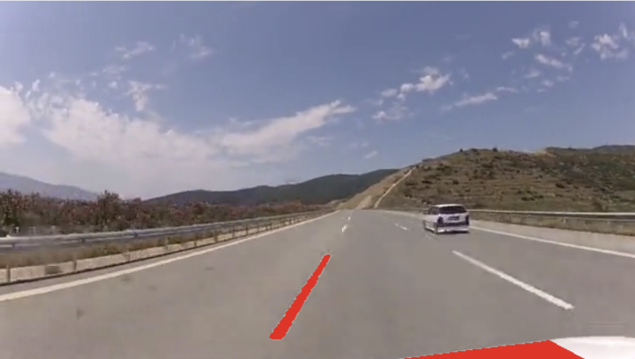

#  **Open Source SW termproject**
#### *Lane Detection*
###### -computer vision technique used to identify and track the lane markings on the road  It plays a crucial role in many applications such as autonomous driving, driver assistance systems, and lane departure warning systems.
---
### **Lane  Detection process** 
#### **: Project that recognizes the direction of lane change in the process of lane change to the left**

---

>>> ***steps***
: Preprocessing  ->  Region of Interest(ROI) Selection  -> Edge Detection  -> Lane Line Extraction  -> Lane Tracking -> Lane Visualization 
- (1) The input image is preprocessed to enhance relevant features and reduce noise. Common preprocessing techniques include grayscale conversion, Gaussian blurring, and edge detection.
- (2) A region of interest is defined to focus only on the area of the image where the lane markings are expected to appear. This helps reduce computational complexity and false detections.
- (3) Edge detection algorithms, such as the Canny edge detector, are applied to detect the edges of the lane markings. This step helps identify the high-contrast boundaries between the lane and the surrounding road.
- (4) The detected edges are further processed to extract the lane lines. Techniques such as Hough transform or curve fitting can be used to identify and represent the lane lines.
- (5) In order to maintain continuity and robustness, the lane lines are tracked over consecutive frames or video streams. This helps handle variations in lighting conditions, road curvature, and other factors.
- (6) Finally, the detected lane lines are visualized on the original image or video stream to provide a clear indication of the detected lanes.
---
## RESULT

### *Project that recognizes the direction of lane change in the process of lane change to the left*

---
## document
###### pros and development of lane detection:

Pros:

Improved driving safety: Lane detection technology allows vehicles to safely stay in their lane.
Advances in autonomous driving technology: Lane detection technology is a key technology for autonomous driving, and it contributes to the advancement of autonomous driving technology.
Increased driver convenience: Lane detection technology can be used by drivers in a variety of driving situations, such as lane changing and parking.

It is expected that the safety and convenience of autonomous vehicles will be further improved with the development of lane detection technology.

Here are some specific examples of how lane detection can be used to improve safety and convenience:

Lane departure warning: Lane departure warning systems use lane detection technology to alert drivers if they are about to drift out of their lane.
Automatic lane keeping: Automatic lane keeping systems use lane detection technology to keep vehicles centered in their lane.
Lane change assistance: Lane change assistance systems use lane detection technology to help drivers safely change lanes.
Lane detection technology is a critical component of autonomous driving, and it has the potential to make our roads safer and more convenient.
---

